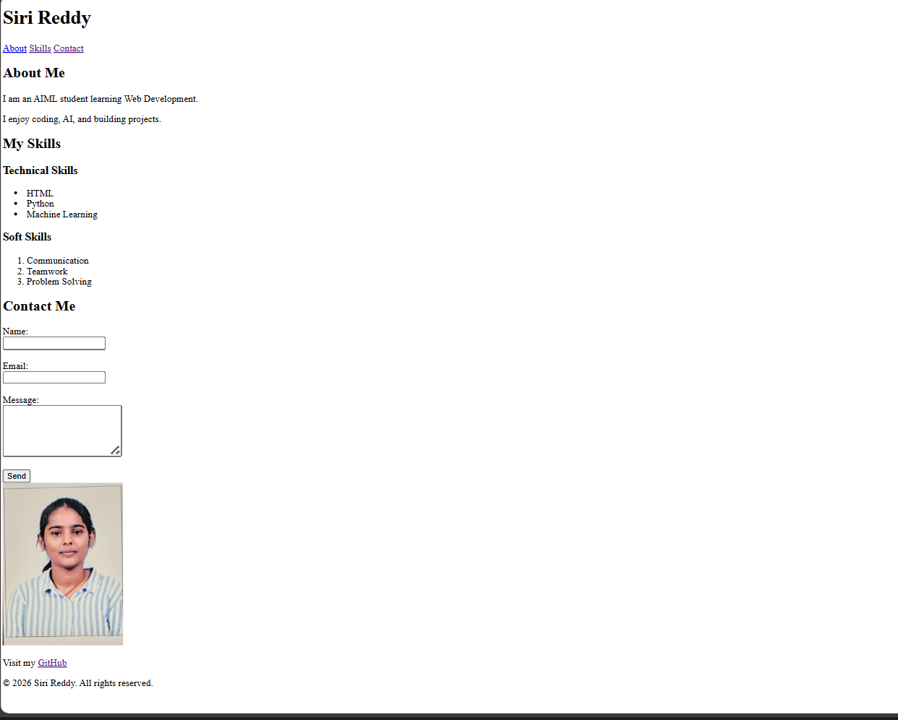

# 🌐 Personal Portfolio Website

## 📖 Project Overview
This is my personal portfolio website created using HTML5 as part of Week 1 Web Development practice.

The website contains multiple sections including:
- About Me
- Skills
- Contact Form

This project helped me understand the structure of HTML and how to build a basic website.

---

## 🛠 Technologies Used
- HTML5
- VS Code
- GitHub

---

## 📂 Project Structure

portfolio-website/
│
├── index.html
├── README.md
└── images/
    └── profile.jpg

---

## 🚀 Features
- Semantic HTML structure (header, nav, main, section, footer)
- Internal navigation links
- Profile image with alt text
- Skills list (ordered & unordered lists)
- Contact form with validation
- Responsive basic layout

---

## ▶ How to Run This Project
1. Download or clone the repository
2. Open the folder
3. Double-click `index.html`
4. View in browser

---

## 📸 Screenshot
## Screenshots

## 👩‍💻 Author
Siri Reddy  
AIML Student | Beginner Web Developer
